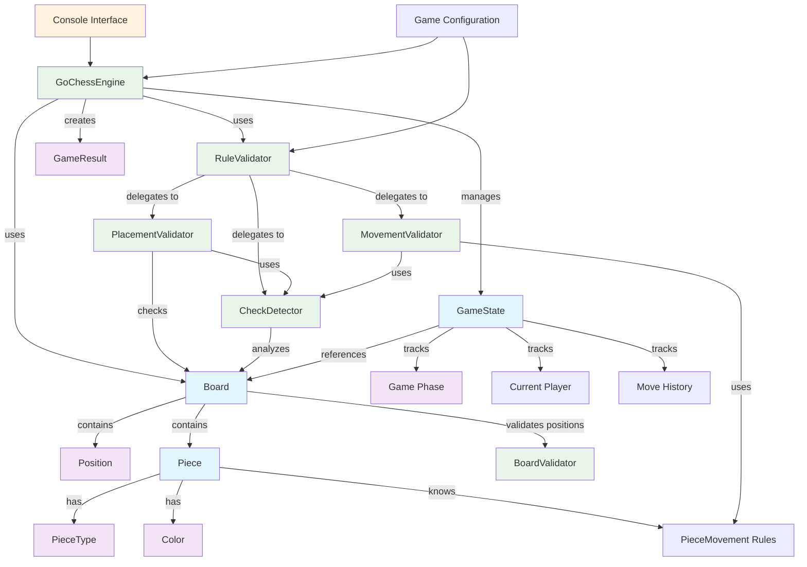

```mermaid
graph TD
    %% External Interface
    Console[Console Interface] --> Engine[GoChessEngine]
    
    %% Core Engine Layer
    Engine --> |uses| Board[Board]
    Engine --> |uses| RuleValidator[RuleValidator]
    Engine --> |manages| GameState[GameState]
    Engine --> |creates| GameResult[GameResult]
    
    %% Board Layer
    Board --> |contains| Position[Position]
    Board --> |contains| Piece[Piece]
    Board --> |validates positions| BoardValidator[BoardValidator]
    
    %% Piece System
    Piece --> |has| PieceType[PieceType]
    Piece --> |has| Color[Color]
    Piece --> |knows| PieceMovement[PieceMovement Rules]
    
    %% Rule System
    RuleValidator --> |delegates to| PlacementValidator[PlacementValidator]
    RuleValidator --> |delegates to| MovementValidator[MovementValidator]
    RuleValidator --> |delegates to| CheckDetector[CheckDetector]
    
    PlacementValidator --> |checks| Board
    PlacementValidator --> |uses| CheckDetector
    MovementValidator --> |uses| PieceMovement
    MovementValidator --> |uses| CheckDetector
    CheckDetector --> |analyzes| Board
    
    %% Game State Management
    GameState --> |tracks| Phase[Game Phase]
    GameState --> |tracks| CurrentPlayer[Current Player]
    GameState --> |tracks| MoveHistory[Move History]
    GameState --> |references| Board
    
    %% Configuration
    GameConfig[Game Configuration] --> Engine
    GameConfig --> RuleValidator
    
    %% Styling
    classDef entity fill:#e1f5fe
    classDef valueObject fill:#f3e5f5
    classDef service fill:#e8f5e8
    classDef external fill:#fff3e0
    
    class Board,GameState,Piece entity
    class Position,Color,PieceType,Phase,GameResult valueObject
    class Engine,RuleValidator,PlacementValidator,MovementValidator,CheckDetector,BoardValidator service
    class Console external

```